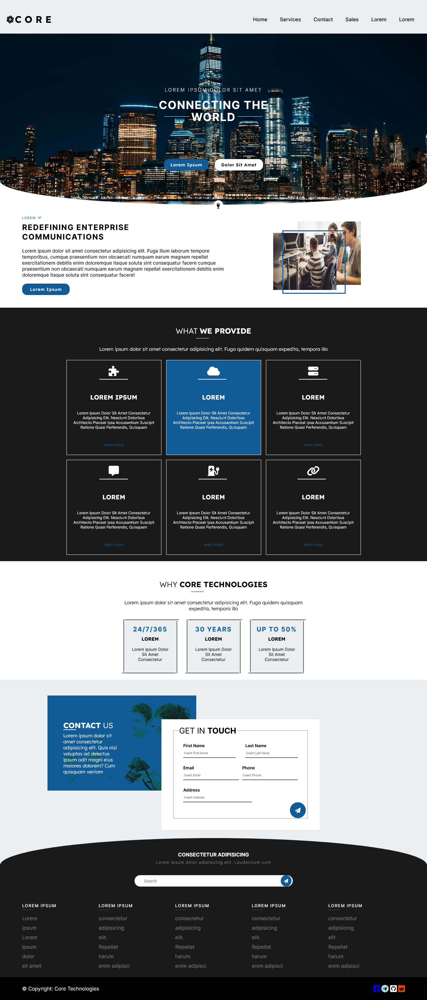

# <h1 align="center">**Internship Assignment**</h1>

<code>HTML</code>, <code>SCSS</code> 

  <h3>
    <a href="https://64c0253f508722173a766b7a--funny-crisp-ce95ac.netlify.app/" color="white">
      Live
    </a>
     | 
    <a href="https://github.com/Ezmad-Ze/Interniship_assignment_one">
      Solution
    </a>
  </h3>

 
 

## About The Project

This project is an implementation of the [Webpage Reconstruction from an Image](assets/Screenshot-from-phone.jpg). The goal of the project is to reconstruct a webpage from an image of the webpage. The image can be taken from any angle and the webpage can be of any size. The project is implemented in HTML and SCSS.

## Instructions

- Install [gulp](https://www.npmjs.com/package/gulp) from npm [read here for more about gulp](https://brandonclapp.github.io/what-is-gulp-js-and-why-use-it/)
- After opening the code, run _npm install_
- Then run _gulp_ on the terminal
- Then go to the localhost on the terminal. **It works!**

## Built with

- Semantic HTML5 markup
- CSS custom properties
- Flexbox
- CSS Grid
- SCSS
- Mobile-first workflow

## Useful Rescources

- [Building navbar](https://dev.to/devggaurav/let-s-build-a-responsive-navbar-and-hamburger-menu-using-html-css-and-javascript-4gci)
- [To check few syntax](https://developer.mozilla.org/en-US/docs/Web/HTML)
- [What's gulp #1](http://brandonclapp.github.io/what-is-gulp-js-and-why-use-it/)
- [What's gulp #2](https://css-tricks.com/gulp-for-beginners/)
- [The gulp sass boilerplate from coder coder blog](https://coder-coder.com/gulp-4-walk-through/)
- [To get scss boilerplate and how to use it. I used Jessica Chan.](https://www.youtube.com/@TheCoderCoder)
- [To create svg for the hero section](https://www.shapedivider.app/)
- [For Icons](https://fontawesome.com/icons)

## Author

- Website - [Ezmad_Ze](https://ezmad.pages.dev/)
